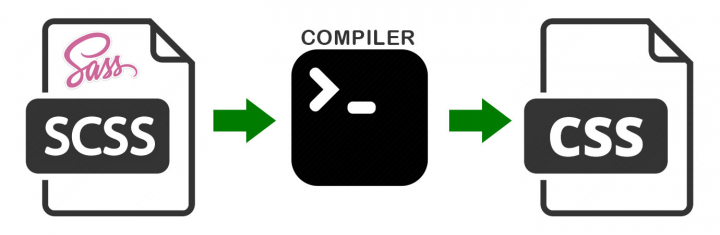

# 10 dias de Sass

De forma similar ao projeto de escrever 30 sites em 30 dias, esse projeto foca em aprender a usar Sass.

## Como Sass funciona?

Sass é tanto uma linguagem como uma ferramenta. O objetivo de Sass é cobrir algumas falhas de CSS e facilitar o desenvolvimento.

Sass lê um arquivo no formato .scss e o converte para um arquivo .css:

## Como usar esse repositório?

1. Faça um _fork_ do repositório para ter sua própria cópia.
2. Crie um diretório com seu nome de usário do GitHub.
2. Para cada dia, crie um diretório com o nome do site em que vai trabalhar (siga os sites na ordem listada aqui, um por dia).
    1. Rode `npm init` no diretório.
    1. Crie um diretório `src`
    1. Crie um diretório `static`
    1. Crie um diretório `public`
    1. Instale `rimraf` como dependência do seu projeto: `npm install --save-dev rimraf`: https://www.npmjs.com/package/rimraf
    1. Instale `sass` como dependência do seu projeto: `npm install --save-dev sass`.
    1. Instale a dependência `http-server` com `npm install --save-dev http-server`: https://github.com/http-party/http-server
    1. Dentro do `package.json` crie um script chamado `copy-static` que rode o comando `cp -r ./static/* ./public/` => copia tudo no diretório `static` para dentro do `public`
    1. Dentro do `package.json` crie um script chamado `build-scss` que rode o comando `sass ./src/style.scss ./public/style.css`
    1. Dentro do `package.json` crie um script chamado `build` que rode o comando `rimraf ./public && mkdir public && npm run copy-static && npm run build-scss`
    1. Dentro do `package.json` crie um script chamado `serve` que rode o comando `http-server ./public`
    1. Dentro do `package.json` crie um script chamado `run` que rode o comando `npm run build && npm run serve`
    1. Se precisar baixar imagens, coloque-as dentro do diretório `static`
    1. No diretório do projeto do dia, crie um arquivo `.gitignore` e adicione os seguintes itens (um por linha): `./node_modules/*`, `./public/*`
2. Seu arquivo index.html deve ser colocado no diretório `static`.
4. Clone o site. **Limite seu tempo de trabalho: 4 horas no máximo!! Tente melhorar seu tempo gasto a cada dia.**. Caso as 4 horas se passem e você não tenha terminado o clone, pare mesmo assim. Reflita sobre o que poderia ter te ajudado a terminar mais rápido. Lembre-se: Não precisa ser perfeito, só precisa ser feito.
5. Pare, pense e responda as 3 perguntas abaixo:
    - 📚 Você aprendeu algo novo hoje? Se sim, o que?
    - 😓 O que poderia ter sido melhor hoje? Há algo que você queira melhorar para a próxima?
    - 🔥 O que foi bem hoje? Houve algo que você gostou?
6. Envie um _pull-request_ com seu código e coloque a respostas para as perguntas acima no conteúdo.
7. Se prepare para o próximo dia.

### Restrições

- Clone apenas a página apontada pelo link.
- Se o site tiver animações, ignore. Clone apenas a aparência.
- **Não** faça o site responsivo. Foque apenas em fazer com que ele funcione no navegador de um computador.

## Documentação Sass

https://sass-lang.com/guide

## Projetos

1. [Lobsters](https://lobste.rs/)
1. [WhatsApp](https://www.whatsapp.com/features/)
1. [IGDB](https://www.igdb.com/discover)
1. [Laracasts](https://laracasts.com/browse/all)
1. [Ubiquiti](https://www.ui.com/products/#default)
1. [Microsoft São Paulo](https://careers.microsoft.com/professionals/us/en/l-sao-paulo)
1. [Stripe Press](https://press.stripe.com/)
1. [Dribbble](https://dribbble.com/)
1. [GoRails](https://gorails.com/series)
1. [TappsGames](http://tappsgames.com/)
